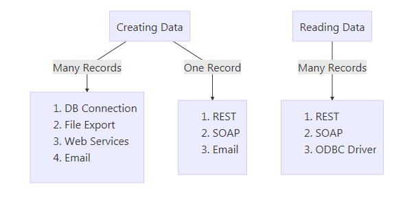

I'm recalling this from memory and this is old and could be updated for
Scripted Rest APIs and such, but Just want to get this out here.

That is really verbose but really all you need to know is what your
doing, and what is preferred like so;

Generally if you are doing a "one time" import, it is almost always
easiest to do a file import, however, sometimes, a database connection
is better, really its the same work. You'll set up a import table, and a
transform map.

If you are setting up a recurring import like from the stock market or
some weather source the following questions ahve to be asked;

## What triggers this data coming into Servicenow

-   If what triggers this data is an interval, then it's just a matter
    of making a scheduled job/workflow that runs on that interval.
-   If what triggers this data is an action, like a major change is
    created, then it's a matter of running the code triggered from that
    update. I'd do this by registering an event, and then in the
    business rule, triggering said event. Then create a script action to
    actually make the web service call (via a script include). This
    might seem like a lot of extra things, but by abstracting this, it's
    much easier to test.
-   If the trigger is a task getting closed in certain state, you can
    try to disable rules to allow you make these changes, or you can
    just trigger the event.

## What data comes into servicenow, a full pull or just what's requested

-   If the data that comes into Serivcenow is an individual record, it
    probably makes the most sense to do a outbound web service call like
    a REST or SOAP Call, that response you get back will have to be
    parsed and then dealt with. I'd recomend dealing with it on a
    transform table because then you can just deal with the data and
    massage it like any other imported data.
-   If the data that comes into Servicenow is a full set of the data, it
    probably doesn't make sense to do it over a web service, as those
    are genearlly paginated and that can be a pain to deal with,
    ideally, you would have read access to their database, and you can
    pull it in.
-   If not, the next best thing would be if they can prepare a single
    file for you to parse that you can read hosted some place. If that's
    not feasible, I'd then look into the possibility of them pushing the
    data to you.
