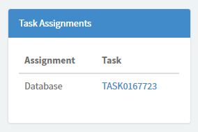

I created a ticket assignments and wanted to share that code. Should
work on any instance unless you have a business rule blocking the
update.



```js
//Client Script
function() {
  /* widget controller */
  var c = this;
}
```

```js
//Server Script
(function() {
  /* populate the 'data' object */
  /* e.g., data.table = $sp.getValue('table'); */
  var gr = $sp.getRecord();
  data.canRead = gr.canRead();
  data.table = gr.getTableName();
  if (!data.canRead || gr.getTableName() != 'sc_req_item') {
    return;
  }

  data.sc_task = [];
  var sc_task = new GlideRecord('sc_task');
  sc_task.addQuery('request_item', gr.getValue('sys_id'));
  sc_task.addQuery('active','true');
  sc_task.orderByDesc('sys_created_on');
  sc_task.query();
  data.sc_task_query = sc_task.getEncodedQuery();
  while(sc_task.next()){
    var label = '';
    var assignment = '';
    if(sc_task.assignment_group != ''){
      assignment = sc_task.getDisplayValue('assignment_group');
    } else {
      assignment = sc_task.getDisplayValue('assigned_to');
    }
    data.sc_task.push({
      number: sc_task.getValue('number'),
      assignment: assignment,
      link: '?id=ticket&table=sc_task&sys_id=' + sc_task.getValue('sys_id')
    })
  }
})();
```

```html
<!--Template-->
<div ng-if="data.canRead && data.sc_task.length>0 && data.table == 'sc_req_item'" class="panel b">
  <div class="panel-heading bg-primary">
    <span ng-if="true" >Task Assignments</span>
  </div>
  <div class="panel-body">
    <table class="table">
      <thead>
        <tr>
          <th>Assignment</th>
          <th>Task</th>
        </tr>
      </thead>
      <tbody>
        <tr ng-repeat="task in data.sc_task">
          <td>{{task.assignment}}</td>
          <td><a href="{{task.link}}">{{task.number}}</a></td>
        </tr>
      </tbody>
    </table>
  </div>
</div>
```
