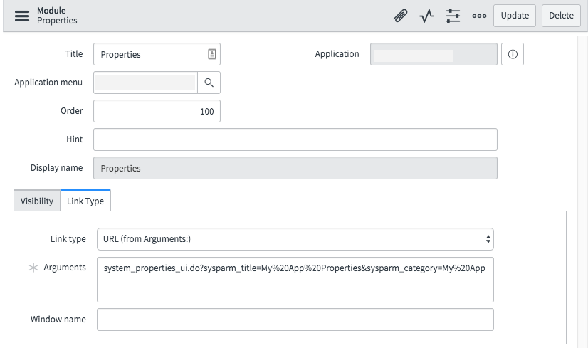
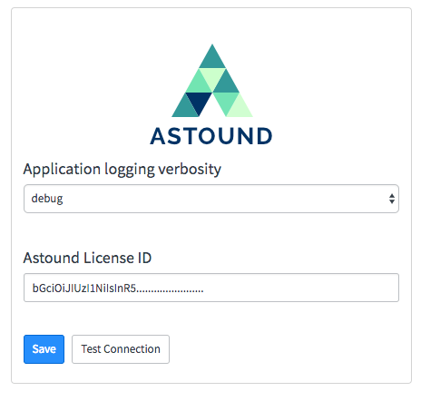

Sometimes you want a nice looking property page. [Ben
Phillips](https://community.servicenow.com/community?id=community_user_profile&user=68211265db981fc09c9ffb651f96192d)
was nice enough to type this out in a slack channel. So I took it and
put it here so I wouldn't forget.

It is recommended/required to create a properties page for any custom
applications you may make.

## Setting up the module

Setting this up is pretty simple if you don't need anything fancy. Just
point the link to "`system_properties_ui.do`" UI Page. Your link will
look something like
`system_properties_ui.do?sysparm_title=MyTitleHere&sysparm_category=MyCategoryHere`



And the resulting properties page will look like this:


## Making a custom page

What if this doesn't include all the things to verify you've configured
your options, or doesn't look how you think it should? No worries.

You can simply make a UI Page to handle this.

To get your properties dynamically on your page, most of the magic is
done with just one glide jelly include:

`<g2:system_properties_categorized category="MyCategoryHere"/>`

This automatically prints out some HTML with the properties and values
from your property category. Since we don't have access to alter the
elements this outputs and they are not styled like we want, I copied the
CSS from the Style Guide and pasted them into my custom properties UI
page. Here we've copied the props box styling from `/login.do`.

The form tag with the action and method is important because that tells
the form to run `system_properties_update.do` when the user clicks Save,
more OOB functionality you can't seem to touch. The referrer is also
important to guide what page loads after they click save.

Here's an agnostic version of Ben's markup in the HTML field of my UI
Page. Client Script and Processing Script panes are empty.

```xml
<?xml version="1.0" encoding="utf-8" ?>
<j:jelly trim="false" xmlns:j="jelly:core" xmlns:g="glide" xmlns:j2="null" xmlns:g2="null">
    <script>
        /* here I can script what happens onclick of the "connect" button. */
    </script>
    <style type="text/css">
        .props {
            width: 34em;
            margin: 0 auto;
            margin-top: 1em;
            padding: 1em;
            padding-top: 0;
            border: 1px solid lightgrey;
            border-radius: 4px;
        }
        #logo {
            padding: 3em 1em 1em 1em;
            margin: auto;
        }
        label {
            font-size: 18px;
        }
        input, select {
            display: block;
            width: 100% !important; 
            height: 32px;
            padding: 6px 9px;
            font-size: 13px;
            line-height: 1.42857;
            color: #343d47;
            background-color: #fff;
            background-image: none;
            border: 1px solid #bdc0c4;
            border-radius: 3px;
            box-shadow: inset 0 1px 1px rgba(0, 0, 0, 0.075);
            transition: border-color ease-in-out 0.15s, box-shadow ease-in-out 0.15s;
        }
        .center {
            display: block;
            margin-left: auto;
            margin-right: auto;
        }
    </style>
    <form action="system_properties_update.do" method="POST">
        <input name="referer" id="referer" type="HIDDEN" value="/this_ui_pages_url.do"/>
        <div class="props">
            <div id="logo">
                
            </div>
            <g2:system_properties_categorized category="Your Property Category Name"/>
            <div class="form-group">
                <div class="form-field input_controls">
                    <button class="listactions btn btn-primary" type="submit" name="action">${gs.getMessage("Save")}</button>
                    $[SP]$[SP]<button class="btn btn-default" name="connect">Test Connection</button>
                </div>
            </div>
        </div>
    </form>
</j:jelly>
```



Special thanks to [Ben
Phillips](https://community.servicenow.com/community?id=community_user_profile&user=68211265db981fc09c9ffb651f96192d)
and @nabil for the work on this.
