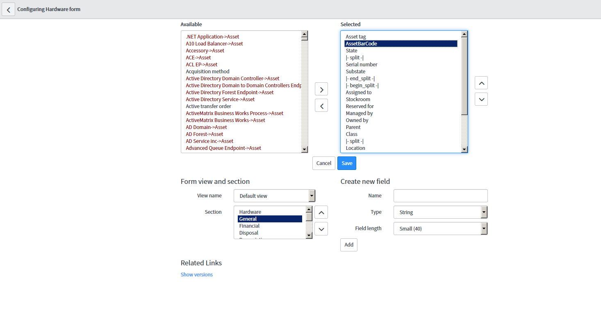
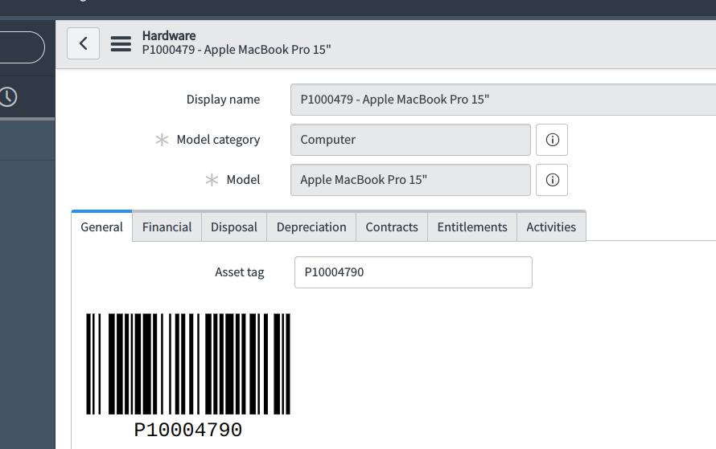

A while ago I answered a question about how to show barcodes on forms in
ServiceNow. I'm just re-posting it here as well as I think it's useful.

So I was able to do this with the help of the
[JsBarcode](https://github.com/lindell/JsBarcode/) library.

Here's how I did it, and how you can do it too;

1.  Create UI Script named `jsbarcode` and copy/paste the library code
    from: https://cdn.jsdelivr.net/jsbarcode/3.3.20/JsBarcode.all.min.js

2.  Create UI Macro with svg with id you will call later.

    ``` {.xml}
    <?xml version="1.0" encoding="utf-8" ?>
      <j:jelly trim="false" 
              xmlns:j="jelly:core"
              xmlns:g="glide"
              xmlns:j2="null"
              xmlns:g2="null">
        <svg id="code128"></svg>
        <!--
            <svg id="ean-13"></svg>
            <svg id="ean-8"></svg>
            <svg id="ean-5"></svg>
            <svg id="ean-2"></svg>
            <svg id="upc-a"></svg>
            <svg id="code39"></svg>
            <svg id="itf-14"></svg>
            <svg id="msi"></svg>
            <svg id="pharmacode"></svg>
            -->
      </j:jelly>
    ```

3.  Create UI Formatter calling UI Macro name plus .xml
    

4.  Add UI Formatter to form.
    

5.  Add onChange script like so to form;

    ```js
    function onChange(control, oldValue, newValue, isLoading, isTemplate) {
      /** Run on load and on change.
      if (isLoading || newValue === '') {
        return;
      }
      */
      ScriptLoader.getScripts('jsbarcode.jsdbx', function() {
        console.log('onchange');
        JsBarcode("#code128", newValue);
        /*
        JsBarcode("#ean-13", "1234567890128", {format: "ean13"});
        JsBarcode("#ean-8", "12345670", {format: "ean8"});
        JsBarcode("#ean-5", "12345", {format: "ean5"});
        JsBarcode("#ean-2", "12", {format: "ean2"});
        JsBarcode("#upc-a", "123456789012", {format: "upc"});
        JsBarcode("#code39", "Hello", {format: "code39"});
        JsBarcode("#itf-14", "1234567890123", {format: "itf14"});
        JsBarcode("#msi", "123456", {format: "msi"});
        JsBarcode("#pharmacode", "12345", {format: "pharmacode"});
        */
      });
    }
    ```

6.  Which should result in something like this;
    
