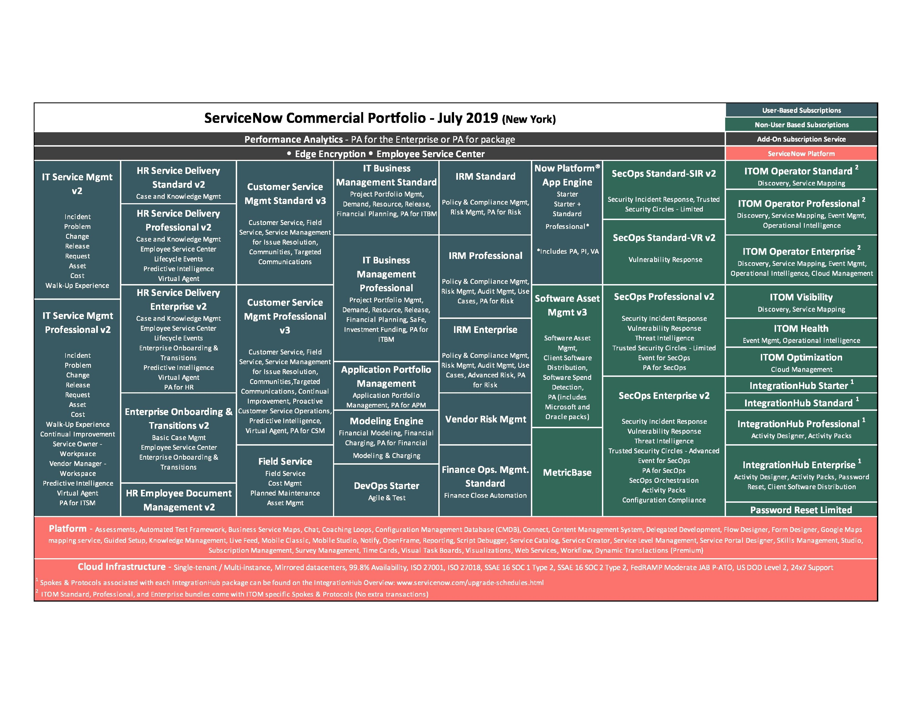
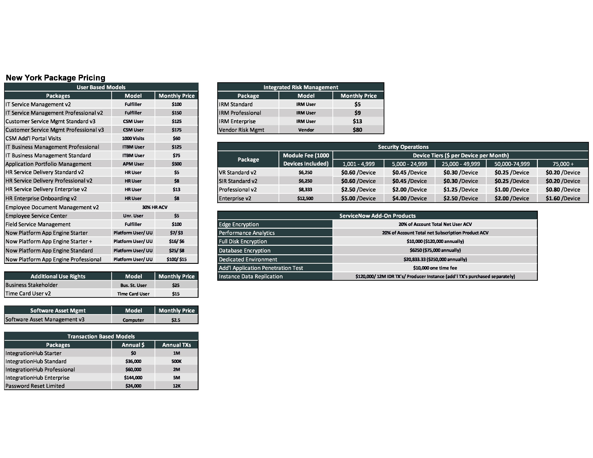
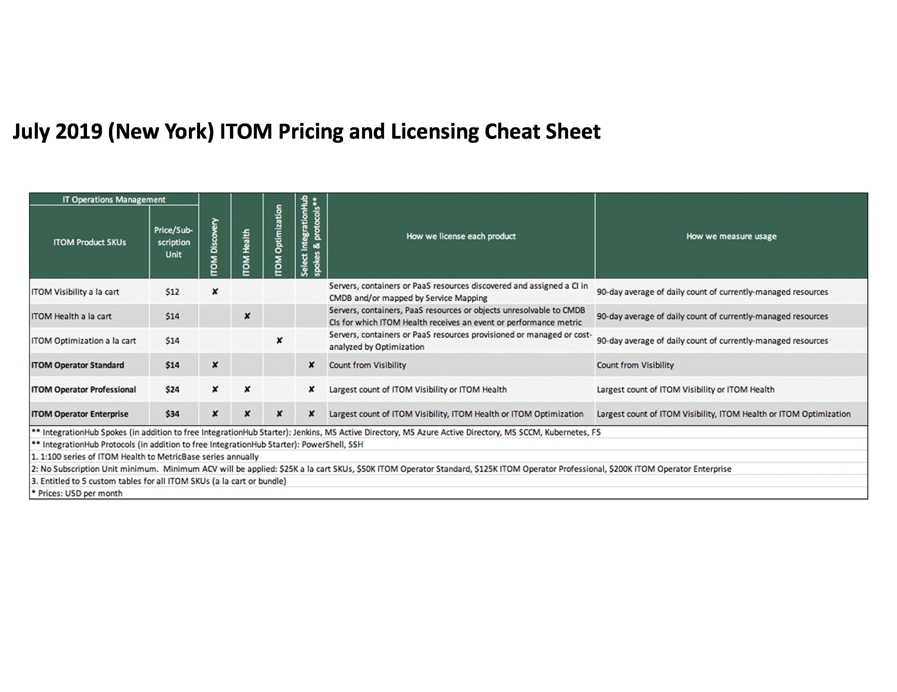

So I decided to take a look at the new licensing. Here's my notes;

## Why platform licensing is changing

Create Custom tables and extend functionality.

## Current Licensing

-   Today customers can build **any** custom table in the **"same
    business purpose"**
-   Unlimited custom tables can be created for the purpose of
    **configuring and customizing the owned products.**

Issues with this are; - Identifying what is **"an app"** and if it was
**"within the same business purpose"** is time consuming and difficult.
- The definitions of **"an app"** and **"business purpose"** are
**subjective**.

## New Licensing

-   Per User model with one **simple, transparent, and objective meter**
    for the extensibility of the platform -- **custom tables**
-   While ensuring we **do no harm** to our products and continue to
    **enable configuration and customization freedom**.
-   This no longer uses business purpose or application definitions.

### Whats included in the new licensing

### Bundled Subscription Entitlements

| New Subscription Package | Custom Tables | Custom Fields | Mobile Studio | Performance Analytics | Virtual Agent | Agent Intelligence |
|--------------------------|---------------|---------------|---------------|-----------------------|---------------|--------------------|
| ITSM Standard            | 25            | X             | 50            |                       |               |                    |
| ITSM Pro                 | 50            | X             | 50            | X                     | X             | X                  |
| ITAM, ITBM, ITOM         | 5             | X             | 50            |                       |               |                    |
| CSM Standard             | 25            | X             | 50            |                       |               |                    |
| CSM Pro                  | 50            | X             | 50            | X                     | X             | X                  |
| HR                       | 5             | X             | 50            |                       |               |                    |
| SecOps, GRC              | 5             | X             | 50            |                       |               |                    |
| DevOps                   | 5             | X             | 50            |                       |               |                    |

### User Licenses

| Product Bundles | Type                    | Licensed By              |
|-----------------|-------------------------|--------------------------|
| ITSM \*         | User                    | Named (ITSM) Fulfillers  |
| ITSM \*         | User                    | Named (ITSM) Approvers   |
| ITSM \*         | User                    | Named (ITSM) Requesters  |
| HR \*           | User                    | HR Users                 |
| ITAM            | Unrestricted User Model | ?                        |
| ITBM            | ?                       | ?                        |
| ITOM            | Unrestricted User Model | ?                        |
| SecOps          | Unrestricted User Model | ?                        |
| GRC             | ?                       | ?                        |
| DevOps          | ?                       | ?                        |

#### Personas Concepts

For ITSM;

-   ITSM Fulfiller has access to all the 50 custom tables to create,
    read, update, and delete any records.
-   ITSM Requester has access to all 50 custom tables to create, read,
    update, and delete **their** records only.

#### Example License use

|                       | ITSM PRO                | Marketing Apps          | Executive Apps               |
|-----------------------|-------------------------|-------------------------|------------------------------|
| Custom Table          | 50                      | 25                      | 75                           |
| User Role             |                         |                         | Executive User               |
| User Role             |                         | Marketing User          | Marketing User               |
| User Role             | ITSM Fulfiller          | ITSM Requester          | ITSM Requester               |
| Subscription Required | ITSM Pro - Fulfiller    | App Engine - Standard   | App Engine - Pro             |
| Subscription Required | ITSM Pro - Fulfiller    | ITSM Pro - Requester    | ITSM Pro - Requester         |
| Entitlements Used     | 50 \* ITSM + M PA VA AI | 50 \* ITSM + M PA VA AI | 50 \* ITSM + M PA VA AI      |
| Entitlements Used     |                         | 25 \* Marketing + M     | 25 \* Marketing + M          |
| Entitlements Used     |                         |                         | 75 \* Executive + M PA VA AI |
| Available             |                         | 25 Tables + M           | 100 Tables + M PA VA AI      |

### Definitions / Other Details

Unrestricted User Model: This means that all users, as long as their
registered users in the user table on the platform get full access to
the custom tables linked to these product bundles

If Table limit is reached, additional table will fall under the "Now
Platform App Engine" subscription

Each custom table under the bundle can have up to 50 custom fields
(inherited custom fields **do count** )

### Now Platform App Engine

| User Package | Custom Tables | Custom Fields | Mobile Studio | Performance Analytics | Virtual Agent | Agent Intelligence |
|--------------|---------------|---------------|---------------|-----------------------|---------------|--------------------|
| Starter\*    | 5             | 25            | X             |                       |               |                    |
| Standard     | 50            | 50            | X             |                       |               |                    |
| Professional | 200           | 50            | X             | X                     | X             | X                  |
| Enterprise   | 4000          | 100           | X             | X                     | X             | X                  |

-   Platform User's are not differentiated like ITSM's fulfillers,
    approvers, requesters.
-   Platform User's consume a entitlement if you have access to a custom
    table. By Access, we mean, "Create Read Update rights".
    -   The following User Actions on a custom table request a
        subscription
    -   Read/View: Look at the custom table or a record in a custom
        table directly
    -   Create/Insert: Create a new record in the custom table, directly
        or indirectly
    -   Update: Update a record in a custom table
    -   Delete: Delete a record in a custom table
-   If a person has a Starter Subscription, they can access up to a
    **max of 5 custom tables**
-   The 5 tables can be different on a user-by-user basis. E.g. If is in
    Marketing and Bill is in HR. They may access 5 **different tables**
    and still be valid Starter Users
-   If the table has Agent Intelligence, Virtual Agent, or Performance
    Analytics, the user **must** have the Professional, or Enterprise
    entitlement.
-   For the starter package, you need to get one for every active
    registered user that doesn't have one of the other subscription
    packages.

### Tables

Types of Custom tables;

| Type       | Access                                        |
|------------|-----------------------------------------------|
| Bundled    | As part of a Product Bundle                   |
| App Engine | As part of a App Engine Subscription per User |
| Exempt     | No subscription                               |

#### Exempt Tables

These tables have been selected because the extension of these tables is
common practice for setting up the core of the platform.

Extending these tables enables you to add them to your scoped
application.

##### Foundational Data

-   cmdb\_\*
-   cmn\_location
-   kb\_knowledge

##### Integrations

-   sys\_import\_set\_row
-   sys\_transform\_script
-   sys\_transform\_map
-   sys\_auth\_profile
-   scheduled\_data\_import
-   sys\_hub\_action\_type\_base
-   sys\_report\_import\_table\_parent

##### System Configruation

-   sys\_dictionary
-   sys\_choice
-   syslog
-   sys\_user\_preference
-   sys\_filter
-   sys\_portal\_page

##### Process Automation

-   sysauto
-   dl\_definition
-   dl\_matcher
-   sf\_state\_flow
-   sc\_cat\_item\_delivery\_task

## Development Implications

Applications are either Paid or Free

| Paid Apps                                                                           | Free Apps                                                    |
|-------------------------------------------------------------------------------------|--------------------------------------------------------------|
| Custom tables are covered in the Application Price.                                 | Custom tables are **not covered** in the Application Price.  |
| Tables that are extended from the original store app tables require a subscription | App Store will list the number of tables in the app.         |
|                                                                                     | Custom tables that are supporting Integrations are excluded. |

Development Considerations

1.  Actively manage and monitor table usage & assignments
2.  Make use of the Exempt tables
3.  Carefully consider the access roles for a new table
4.  Be aware of how many tables are available within a bundle
5.  Extensions of core tables are counted (e.g. extending incident)
6.  AI on a custom table requires a Pro or higher subscription
7.  Leave enough room for future development needs
8.  Be aware of the custom field limits for a table

## New York Pricing

I came across a [shared pdf file](./new_york_one_pager.pdf) on Slack.

## Further Reading

-   [Understanding your servicenow
    licensing](https://blog.jace.pro/post/2017-12-02-licensing/)
-   [New York One Pager](./new_york_one_pager.pdf)
