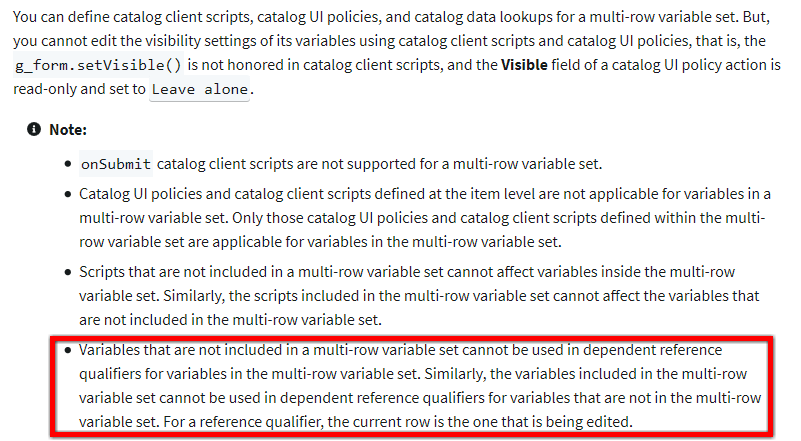

So It's been asked a few times, "How can I make my MVRS variables depend on other variables?"
<!--more-->
The question has some caveats;

1.  If the Variables are all in the same row, that's possible.
1.  If the Varialbes are not all in the MVRS, it's possible but you need to add stuff to the MVRS.

Let's go over each of those.

So I'm going to deal with the 2nd one first.  It's a design choice that you cannot make the mvrs variables dependent on variables outside of the row.  The way around this is to add the variable to the MVRS and use that copy instead of the non-MVRS.  I don't see another way around this.  

Now that is dealt with the only time this comes up is if you seem to want to use a Lookup Select variable that re-evaluates based on other variables.  I've [written about this in the past here](https://blog.jace.pro/post/2017-10-28-lookup-select-attributes/).  If you're not familiar with it might be worth reading that.

Now I'm going to add reproduction steps cause I don't want to re-create things all over.  
So lets decide out test.  Let's load all .. notification devices for a user, based on a user variable.  

1.  On your PDI import my ["ATF" scoped app](https://atf.jace.pro/).
2.  URL: `https://github.com/jacebenson/atf.git`
3.  Change scope to "ATF"
4.  Goto maintain items, and look for "Test Item"
5.  Open the variable set "Multi Row Variable Set"\
    At this point you should see a "question" and "answer"
6.  Rename "question" to "user"
7.  Change it's type to "reference" to `sys_user`
8.  Rename "answer" to "device"
9.  Change it's type to "lookup select box"
10. Set it's table to `cmn_notif_device`
11. Add a variable attribute of `ref_qual_elements=user`
12. Add a reference qualifer of \
    `javascript: 'user=' + current.variables.user`

Now when I try this is just works.

<video width="320" height="240" controls>
  <source src="works.mp4" type="video/mp4">
</video>

Now say you don't want the Refernce in the MVRS.  Okay.  I have a Refernce variable on this test item already, it has a silly name, "Reference".  But it works.  Lets try that and change the variable attribute and reference qualifer.

1. Change variable attribute to `ref_qual_elements=Reference`
2. Add a reference qualifer of \
    `javascript: 'user=' + current.variables.Reference`

You'll notice this doesn't appear to work.  It seems this is as designed 😭.

Further Reading: 

- [Community Post](https://community.servicenow.com/community?id=community_question&sys_id=9b19bc91dba7bfc0414eeeb5ca96199d)
- [MVRS Documentation](https://docs.servicenow.com/bundle/newyork-it-service-management/page/product/service-catalog-management/concept/c_ServiceCatalogVariableSets.html)
- [ref_qual_elements Documentation](https://docs.servicenow.com/bundle/newyork-it-service-management/page/product/service-catalog-management/reference/variable-attributes.html#d768259e337)

<a style="background-color:black;color:white;text-decoration:none;padding:4px 6px;font-family:-apple-system, BlinkMacSystemFont, &quot;San Francisco&quot;, &quot;Helvetica Neue&quot;, Helvetica, Ubuntu, Roboto, Noto, &quot;Segoe UI&quot;, Arial, sans-serif;font-size:12px;font-weight:bold;line-height:1.2;display:inline-block;border-radius:3px" href="https://unsplash.com/@callmefred?utm_medium=referral&amp;utm_campaign=photographer-credit&amp;utm_content=creditBadge" target="_blank" rel="noopener noreferrer" title="Download free do whatever you want high-resolution photos from Frederick Tubiermont"><svg xmlns="http://www.w3.org/2000/svg" style="height:12px;width:auto;position:relative;vertical-align:middle;top:-2px;fill:white" viewBox="0 0 32 32"><title>unsplash-logo</title><path d="M10 9V0h12v9H10zm12 5h10v18H0V14h10v9h12v-9z"></path></svg>Frederick Tubiermont</a>