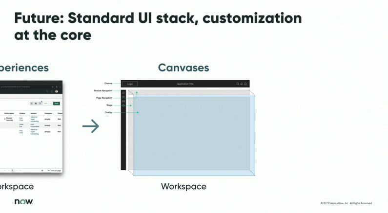
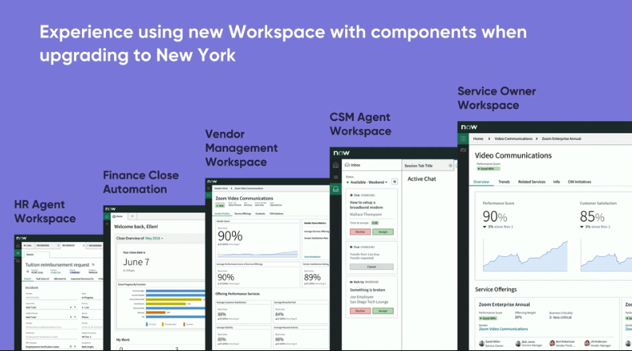
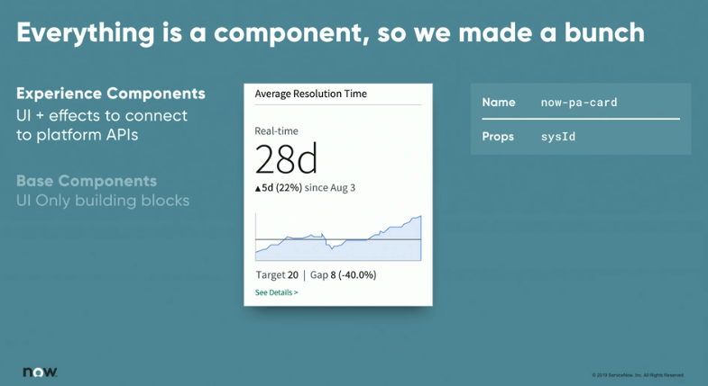
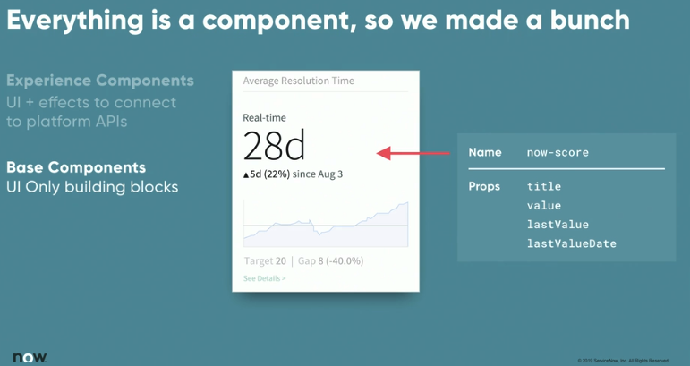
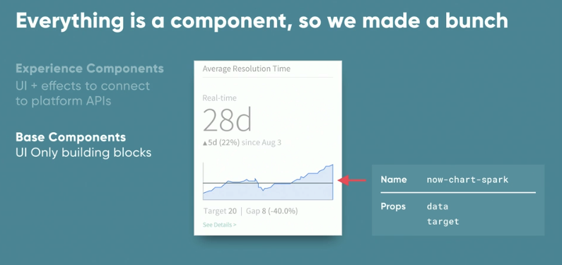
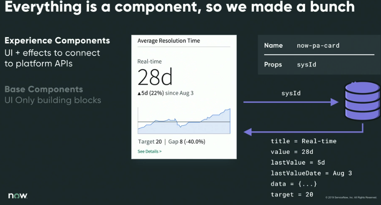
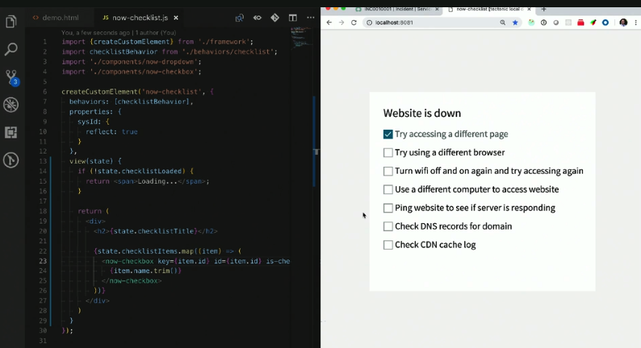

That's my prediction.  Service Portal will no longer get updates by the Orlando release. 

I know it's only been out since [Helsinki](https://docs.servicenow.com/bundle/helsinki-release-notes/page/release-notes/servicenow-platform/r_ServicePortalRN.html)
and that means since April 2016 which is ~4 years. But after you look at these findings, you'll agree.

## Why bring it up?

Well, I don't like to work on something that isn't going to get support.  Things that do not get active development generally are left behind.
They are hard to maintain because any *new* features need to be built by the customers using them.  Want to see some active examples?

| New Feature    | New Feature last notable update | Old Feature | Old Feature last notable update |
| -------------- | ------------------------------- | ----------- | ------------------------------- |
| Dashboards     | New York: Multiple Breakdowns   | Home pages  | Homepage layouts (Summer '08)   |
| Flow Designer  | New York: Multiple Updates      | Workflow    | Created Workflow (Summer '08)   |
| Service Portal | New York: Agent Chat            | CMS         | Created CMS (Summer '09)        |

Would ServiceNow keep development efforts on Service Portal and the New Design System?  Unlikely.

In the past they haven not ever announced they would od this kind of dual development.  According to [this talk](https://community.servicenow.com/community?id=community_article&sys_id=6246e75cdb9d3b0422e0fb2439961965) all out of box forms will use these components that are part of this.

## What is the New Design System?

Before we dive into what this is, lets talk about **why** it's needed.

1.  Keeping ServiceNow tied to Angular 1.5.3 is not maintainable.  
2.  Any new functionality developed needs to be custom developed by someone to use in SN.
3.  No ability to use new tech in the old system.

So, now that we know why it's needed, lets talk about the new design system.

At it's core everything is on a "Canvas".  When you customize the canvas, it appears ServiceNow is calling that an "Experience" and Pre-defined experiences are called "Workspaces" which we've seen since Madrid (See Agent Workspace).

So to repeat;

- Canvas: Base building block for new design system.  I'd compare this to a UI Page.
- Experience: A name for a customized Canvas.
- Workspace: A Experience with navigation and general UI components.

## How is the design System built?

ServiceNow has not made that clear, but they did say it's all built on Jelly, then said, "Just Kidding".  I am not sure.

The **ServiceNow UI Framework** is a custom Javascript framework built using web components. On top of that framework is the metadata layer.

  - [Based on web components stardard: custom elements + shadow DOM](https://developer.mozilla.org/en-US/docs/Web/Web_Components) is what this is based on
  - Write testable, re-usable effects that respond to actions
  - Shared effects: all your platform API calls, no more messy spaghetti code These are custom to SN
  - Everything is a component, and that's great
  - One target stack with customization and composition built into core.

There are two kinds of components;
- Experience Components - These are a UI and effects to connect to the platform API 
- Base Components - UI only building blocks  

How does it work together?

## What will this look like

In the video they actually create a widget using web components for ServiceNow.  Below is a screenshot, but also here is a link to the talk.  This part starts @25:57.

## Sources

- [CreatorCon2019 - CCB0702](https://community.servicenow.com/community?id=community_article&sys_id=6246e75cdb9d3b0422e0fb2439961965)
- [Day 3 Keynote, @51:44](https://knowledge.servicenow.com/video-library/day-3-spotlight-creatorcon-full.html)
