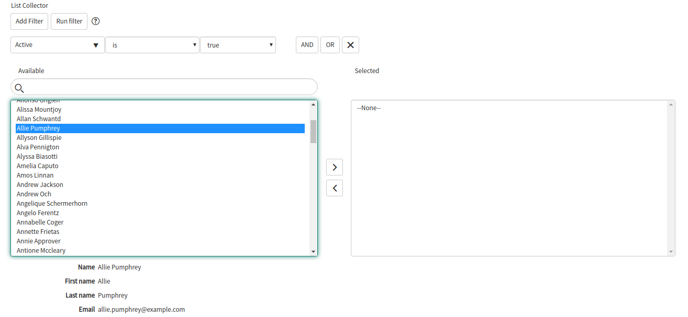

List collectors try so very hard to be helpful.  

I have used them, but I don't like them and here's why;

- Impossible to report on
- SP display of extra columns is... not helpful (see screenshot)
  
- Display values are tied to the table, not the instance of the variable
- Generally complex logic is required to handle if you ever automate around them
- They are moot with "add to cart"
- In SP it's not clear what columns are when you add them via `ref_ac_columns`[1]
- They were not made mobile friendly, so now they have a very different look/feel in SP[2]
- ~~You have to have a table made for it's purpose which is overkill~~ Covestic posted a workaround

The list isn't that long, but it merits a conversation about **what** you're trying to collect.

Before London, there was no good out of box alternative.  With London we got the Multi-Row Variable Sets, and sure they also have their flaws, they are not as bad as List collectors.

In my past the most common use for List collectors is to grant access or to modify a number of things in different ways.  The problem with that is, you can't specify after you've selected all the things what you want to do **individually**.  So in practice, it would be a User Access form.  You pick the users you want to change access for, but then you are only allowed to add one role, or group.  

## Covestic's workaround
This is a great way to do the options without a whole table.. but then someone still has to manage these options.[3]

1. On your catalog item, create a new multiple choice or select box variable (either will work, we are after the "Choices" related list here), give it a name and some question text and then submit.
1. Add any choices your variable needs.
1. Switch the variable type over to a list collector. You will notice that we cannot save until we give ServiceNow a table to reference so pick Question Choice [`question_choice`]
1. Add a reference qualifier of "question=XXXX" where XXXX is the question’s sys_id.
1. (Optional) You may want to deactivate the "Question Choice Related List" client script or modify the if statement in the script to be if (newValue == "3" || newValue == "5" || newValue == "21") to show the Question Choice related list on list collector variables.
1. You now have a list collector variable without having to create a whole new table.
1. (Optional) You can now think about adding variable attributes such as `no_filter` or `glide_list` to alter the variable’s appearance on the form.

[1]: https://hi.service-now.com/kb_view.do?sysparm_article=KB0696884
[2]: https://hi.service-now.com/kb_view.do?sysparm_article=KB0635149
[3]: https://www.covestic.com/servicenow-tips-making-list-collectors-useful/