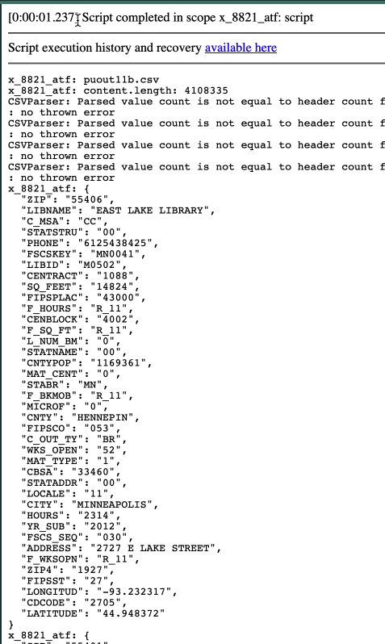

As part of my getting familiar with some of the new features of Orlando, I wanted to dive into the new CSVParser class.

## Why might I use this?

So in looking for use-case I found a community post by [Vinod].  He has a csv file that he needs to parse.  Good enough for me.  [Ankur Bawiskar] proposed a solution, but it's using some Packages call, that is not supported in scopes.  With that lets dig in.

I am using the [Library survey from 2011](https://catalog.data.gov/dataset/fy-2011-public-libraries-survey)  data and I'm planning to write that to an import table, then to that could be used to update Locations.

```js
// Original solution
var sa = new GlideSysAttachment();
var bytesContent = sa.getBytes("incident", "bdd212d04fbf7340fc11fa218110c7d5");
var strData = String(Packages.java.lang.String(bytesContent));
gs.print(strData);
```

Lets try this with CSVParser.

Oofta.  So Below is my "working" example.  A few important notes;

1.  `parseLineToObject` needs the array for the headers.
1.  If your CSV is mixed with quotes and without, you're going to have to correct that, like I did.

```js
// to object
var attachment = new GlideSysAttachment();
var agr = attachment.getAttachments('incident', '552c48888c033300964f4932b03eb092');
while (agr.next()) {
    gs.info(agr.getValue('file_name'));
    var content = attachment.getContent(agr);
    var contentb64 = attachment.getContentBase64(agr);
    gs.info('content.length: ' + content.length);
    // CSV Parser splits the data up
    var contentArr = content.split('\n');
    var headers = [
        "STABR", "FSCSKEY", "FSCS_SEQ", "LIBID", "LIBNAME", "ADDRESS", "CITY", "ZIP", "ZIP4", "CNTY", "PHONE", "C_OUT_TY", "C_MSA", "SQ_FEET", "F_SQ_FT", "L_NUM_BM", "F_BKMOB", "HOURS", "F_HOURS", "WKS_OPEN", "F_WKSOPN", "YR_SUB", "STATSTRU", "STATNAME", "STATADDR", "LONGITUD", "LATITUDE", "FIPSST", "FIPSCO", "FIPSPLAC", "CNTYPOP", "LOCALE", "CENTRACT", "CENBLOCK", "CDCODE", "MAT_CENT", "MAT_TYPE", "CBSA", "MICROF"
    ];
    // with out this, the call fails;
    // now if you csv is not formed consistentlt yhis still fails.... so im just going to remove ,'s in quotes, then quotes.
    contentArr.forEach(function (line) {
        // regex to remove commas from within `"` parts e.g. a,b,"test,test./#&"
        var regex = /"([A-Z0-9\s\.#-\/&]+),([A-Z0-9\s\.#-\/&]+)"/gm;
        var subst = "$1$2";
        line = line.replace(regex, subst);
        // regex to remove comma from within " at the end e.g. a,b,"test,"
        var regex2 = /"([A-Z0-9\s\.#-\/&]+),"/gm;
        var subst2 = "$1";
        line = line.replace(regex2, subst2);
        var delimiter = ',';
        var quoteCharacter = '';
        try {
            var lineObj = new sn_impex.CSVParser().parseLineToObject(line, headers, delimiter, quoteCharacter);
            if (lineObj.STABR == "MN" && lineObj.CITY == "MINNEAPOLIS") {
                gs.info(JSON.stringify(lineObj, '', '  '));
                /*do what you want here... like make a record or whatever*/
            }
        } catch (e) {

        }

    });
}
```

Here's what the output looks like;




Source: https://docs.servicenow.com/bundle/orlando-application-development/page/app-store/dev_portal/API_reference/CSVParserScoped/concept/CSVParserScopedAPI.html