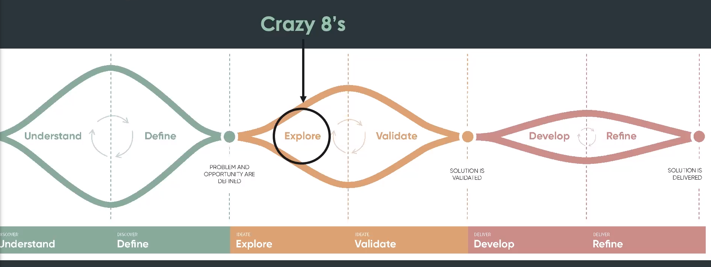

This is "Connect Week".  Here's what I watched and my very rough notes.

- [GlideQuery: A modern upgrade to GlideRecord](https://players.brightcove.net/5703385908001/zKNjJ2k2DM_default/index.html?videoId=ref:K20-CCB3052)
- [Lab/Workshop Advanced Scoped Development Techniques (CCW2583)](http://players.brightcove.net/5703385908001/zKNjJ2k2DM_default/index.html?videoId=ref:K20-CCW2583)
  - [Lab](https://nowlearning.service-now.com/lxp?id=overview&sys_id=f89a140b1b74d4901759b8c11a4bcbd4&type=course)
  - Guided Application Creator
  - Code Search
  - Source Control
  - Adding files to the studio project
  - Deployment Best Practices
<!-- Full Stack Developer series... was last week.. also this week.- -->
- [KEY4943](http://players.brightcove.net/5703385908001/zKNjJ2k2DM_default/index.html?videoId=ref:K20-KEY4943)
  - Encourage networking
  - K20's whole event's objective is "focused on helping customers to achieve their business objects through digital transformation" - David Schneider
    - What does that really mean?
    - I mean, does that mean showing customers how others have gotten there?
    - Or does that include ...
  - 85-90% of the content is given by customers
  - Themes for customers needs.
    - Customers need to be able to help themselves via on-demand resources
      - Customer Success Center is a curated list of the best content based on usage and customer's telling us.
    - Customers want community-based success experiences
      - ServiceNow User Groups (Globally available)
      - Knowledge
      - Now Community ... stats okay, its a big and busy community. 
      - Success webinars
      - Success consultations
      - Genius Lounges
      - Meetups (this developer meetups?) 
    - Wants access to access to ServiceNow experts, blueprints for success that will help them
      - Sept 2019 NowLearning was released.  Over 600k courses completed.
        - Catalog of NowLearning content is just getting added too, so the catalog is only going to get bigger and bigger as time continues.
      - Other Sites to help
        - Developer portal
        - Product docs
        - Now support portal
        - Now support mobile app
  - Calls to action
    - Visit the Customer Success Center
    - Get involved of "Success experiences"
    - learn about success services
  - Jace's take.  Community is big, you can get a lot from local events like the ServiceNow User Groups, and meetups.  You can encourage people to use NowLearning to up their skills.  However, ultimately, they recommended to buy success services from ServiceNow.
- [Knowledge Management](http://players.brightcove.net/5703385908001/zKNjJ2k2DM_default/index.html?videoId=ref:K20-DEM1202)
  - Provide consistent resolutions for self-service
  - Encourage employees to create knowledge from their work
  - Identify gaps, curate new content, track usage, gov', and quality trends
  - This Shows how it can be used from desktop/mobile/chat apps
- [Augmented Reality for Field Service Management via CareAR](http://players.brightcove.net/5703385908001/zKNjJ2k2DM_default/index.html?videoId=ref:K20-BRE2961)
  - Primary user servicing expectations
    - Fast
    - Personalized 
    - Consistent
  - So this is all about making video/collaborate, not using 3rd party consumer apps, aka FaceTime, Facebook messaging etc.  It is pretty cool @ 18:20 you can see a demo of it.
- [Lab/Workshop Story Testing Scripts - Scoped Application (CCW2554)](http://players.brightcove.net/5703385908001/zKNjJ2k2DM_default/index.html?videoId=ref:K20-CCW2554)
  - This appears to be a lab to create a scoped app to build test scripts... Not sure how this is different than Test Management
  - Best Practices for this* (@55:16)
    - Define involved users and roles of the story
    - Create a Test Script
    - Create Scenario for the Story
- [Lab/Workshop Working with Remote Tables (CCW1735)](http://players.brightcove.net/5703385908001/zKNjJ2k2DM_default/index.html?videoId=ref:K20-CCW1735)
- [Theater Generating Ideas Fast with Crazy 8’s (THS3220)](http://players.brightcove.net/5703385908001/zKNjJ2k2DM_default/index.html?videoId=ref:K20-THS3220)
  - What are Crazy 8s
    - Crazy 8's is a brainstorming exercise that challenges people to sketch 8 distinct ideas in 8 minutes.  The goal is to push beyond your first idea, and generate a wide variety of solutions to any challenge.
  - When you use these?  Early on in the ideation process.  Or anytime you are stuck on a problem.
    - At ServiceNow they typically do it here;
      
  - Conducting Crazy 8's 
    - Pre session
      - Gather Stakeholders.  Anyone invested in the project.  Crazy 8's session can dbe done alone, it's best with 3-4 people.
      - Review previous activities.  A good way to get the team aligned is to review some of the projects past activities.
      - Understand the problem.  Have key stakeholders deliver the problem.
      - Warm up.  Allow the team to do some research and walk through existing solutions to similar problems.
      - Use Prompters.  Share a few prompter ideas for people who have a hard time thinking through 8 variations.
      - Collate materials.  Sheet of paper for each stake holder, pens, and a way to track time.  Digitally, Video conf. with google slides.
    - During the session
      - Fold paper into 8 segments (first in 4 parts, then in half.)
      - Set the timer 60 seconds per segment (8 minutes total)
      - Participants sketch on the first segment until the timer dings.  Then they move the next until all 8 segments have been filled.
      - Have participants Explain ideas individually.
      - Give participants a set number of votes on for things they like e.g. green dots.
      - Give participants a set number of votes on for things they dislike e.g. red dots.
      - As a team discuss where the ideas coalesced
    - Post session
      - Story board the workflows
      - Add more details to the better ideas
      - Build out prototypes
      - Consider a second crazy 8's session with a different group      
- [Creating products on the Now Platform® to drive company growth](http://players.brightcove.net/5703385908001/zKNjJ2k2DM_default/index.html?videoId=ref:K20-BRE1066)

Non SN stuff;

[Lockdown Productivity: Spaceship You](https://www.youtube.com/watch?v=snAhsXyO3Ck)