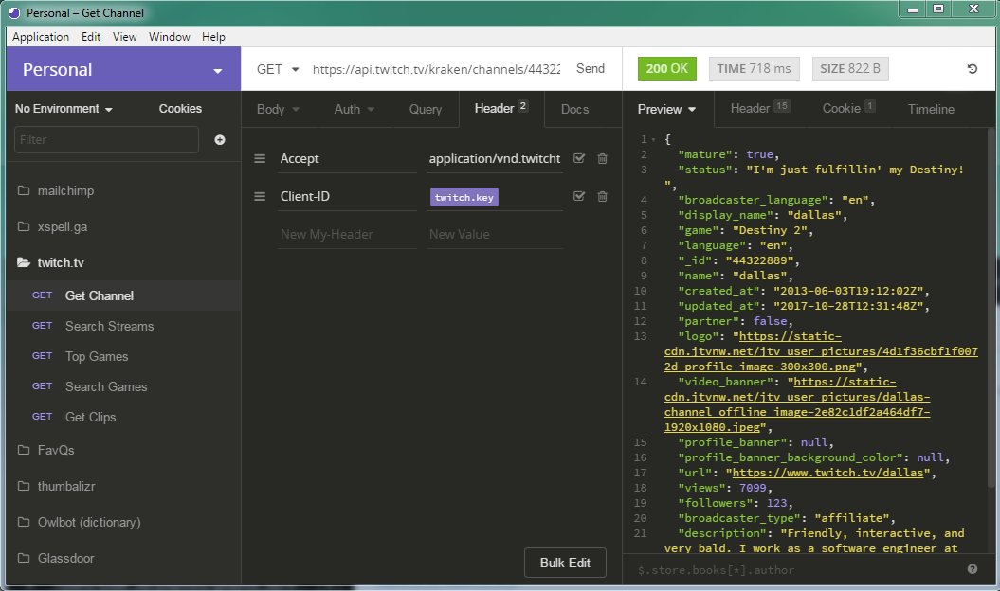
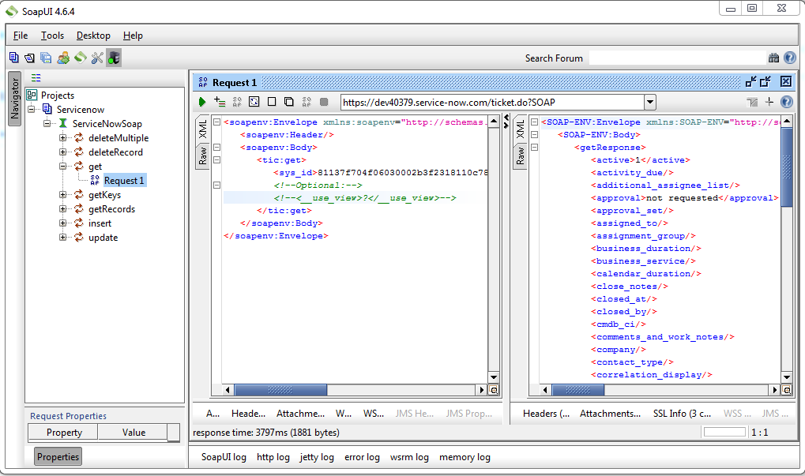
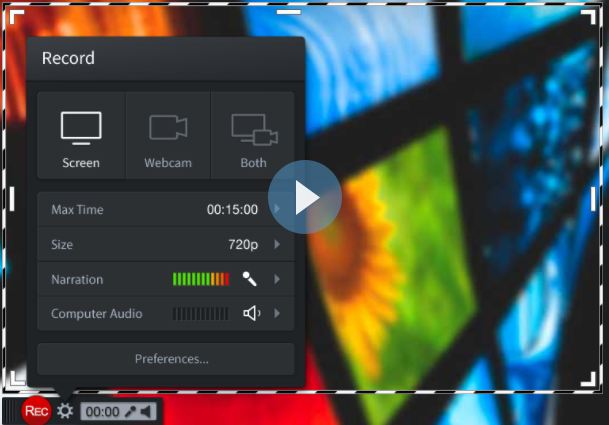

The way I set up my workspace for development

# Setup Workspace for development

-   [Software](#software)
    -   [Rest Client](#rest-client)
    -   [Soap Client](#soap-client)
    -   [Screen-capture](#screencapture)
    -   [Password Manager](#password-manager)
    -   [Android Studio](#android-studio)
    -   [Git](#git)
    -   [Text Editor](#text-editor)
    -   [Virtual Box](#virtual-box)
    -   [Command Line](#command-line)
    -   [2FA](#2fa)
    -   [Clipboard Manager](#clipboard-manager)
    -   [Browsers](#browsers)
-   [Accounts](#accounts)
    -   [Github & Gitlab](#github-gitlab)
    -   [Developer.servicenow.com](#developerservicenowcom)

## Software

It's important to have your software set up to quickly test/prototype
and make solutions. Below are the things I think every developer needs
and my personal applications I use.

### Rest Client

A separate Rest Client is really important because otherwise you may
login as the *test* account you're using.

Today I use [insomnia.rest](https://insomnia.rest/). It's great. I have
a workspaces in it for my personal APIs, ServiceNow's APIs and more.

Here's what it looks like, you can see also it's variable stuff where I
have the `twitch.key` but it's not visible.

### Soap Client

Sometimes you are forced to use SOAP. There is a pretty good tool for
testing those connections locally called
[SOAPUI](https://www.soapui.org/downloads/soapui.html). It does have
REST and SOAP things but I just use it for SOAP. For ServiceNow
projects, just goto the target table
e.g. dev12345.service-now.com/ticket.do?WSDL, save the page as a file,
and make a new Project using that file.

### Screen capture

I generally alternate between [Windows Snipping
Tool](https://support.microsoft.com/en-us/help/13776/windows-use-snipping-tool-to-capture-screenshots)
and [Screencast-o-matic](https://screencast-o-matic.com/). If I need to
do any kind of notation or video, I use Screencast-o-matic. I initially
used this as it supported Linux, Windows, and Mac, but now they only
support Windows, and Mac.

If you're on windows this pairs well with
[KeyPosé](http://jungsbluth.de/magnus/blog/2008/08/01/keypose-flavour-your-screencasts-with-shortcuts/)
to show key presses.

### Password Manager

When I did consulting I had to remember hundreds of logins. That's not
an easy feat. It was then I decided I'm going to use a password manager.
I've never looked back. [Bitwarden](https://bitwarden.com) has been
great for me. You have to make a few setting modifications so it doesn't
set fields automatically (because you don't want it to update a password
value accidentally). Outside of that it's pretty great.

### Android Studio

[Android Studio](https://developer.android.com/studio/index.html) is
awesome for mobile testing, but it does take some time to stand up.

### Git

[Git](https://git-scm.com/download) is great.

### Text Editor

I'm going to try to tread lightly here. Everyone has their favorites,
I'm just going to say I use [VS Code](https://code.visualstudio.com/).
There are a [number of great, popular
ones](https://www.google.com/search?q=best+text+editor) to try out, it's
nice to have one to work on files locally.

### Virtual Box

Sometimes you have to ensure your sites work on certain versions of IE
as the updating of IE historically has been awful at a lot of places. At
least [Virtual Box](https://www.virtualbox.org/) let's you do it.

So when I found Microsoft officially makes virtual machines to test
different versions of IE, I bookmarked that in a hurry. Here it is,
[Microsoft's Official Virtual
Machines](https://developer.microsoft.com/en-us/microsoft-edge/tools/vms/).

### Command Line

~~Unless you're on a Windows 10 machine with it's
[bash](https://blogs.windows.com/buildingapps/2016/03/30/run-bash-on-ubuntu-on-windows/)
or using a Mac with it's native bash, or on Linux, you need something
better.~~ It's so slow. I've given up on WSL.

I've used [ConEmu](https://conemu.github.io/) for quite a while and it's
pretty great.

### Clipboard Manager

I really like the cross-platform versions of these things and as such I
use [1Clipbaord](http://1clipboard.io/)

### Browsers

You gotta have at least the 3 major players;

-   [Firefox](https://www.mozilla.org/en-US/firefox/new/)
-   [Chrome](https://www.google.com/chrome/)
-   [Internet Explorer](https://support.microsoft.com/en-us/help/17621/internet-explorer-downloads)

## Accounts

### Github & Gitlab

If you have Git, you need a place you can use git. These are two of the
free services folks use.

-   [Github](https://github.com) is the most known.
-   [Gitlab](https://gitlab.com) has a ton of free features and allows
    free private repos.

#### Probot

This is a Github account bound thing that can do all sorts of stuff.
It's pretty useful, check it out here <https://probot.github.io/>
Currently I use;

-   [Pull](https://probot.github.io/apps/pull/)
-   [Delete Merge
    Branch](https://probot.github.io/apps/delete-merged-branch/)

### ServiceNow

You need one of [these accounts](https://developer.servicenow.com) for a
Personal Developer Instance.
