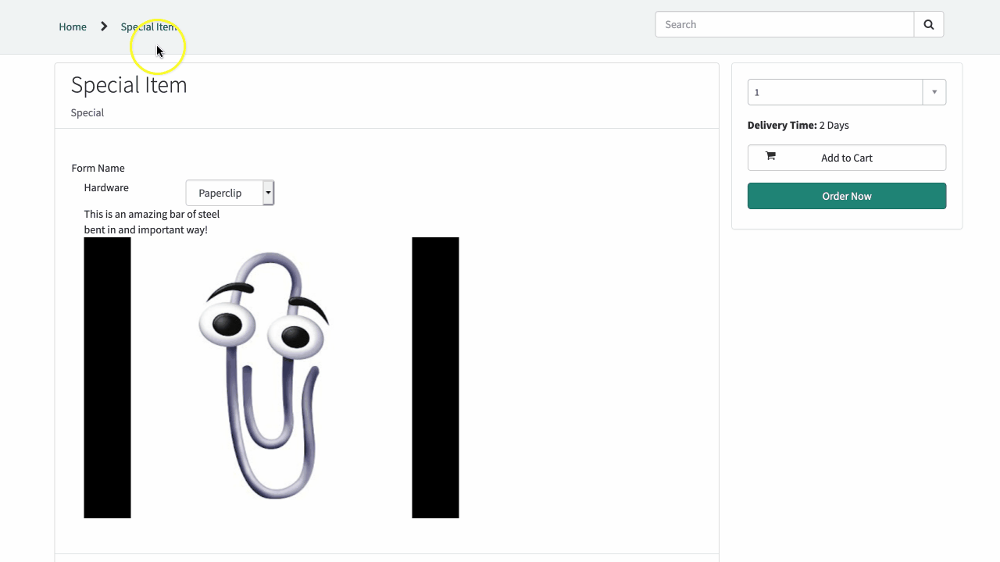

Sometimes, you have to really control your form.  For the most part you can 
use the out of box variable types ServiceNow gives you and the messages they give you.

But, sometimes, that just won't due.  In these times you have own the form.  You might
asking, "Jace, how do you do that?  DOM Manipulation is bad mmkay."  You're right, 
ServiceNow HATES dom manipulation.  Eventually that will break.  So I don't suggest that.
However, you can use a custom macro for UI 16, and a SP widget for Mobile/SP things.

This is one way to do that.  Really this is just an extension of the work that Cody Esmay
and Hunter Wolf did for a [lab](https://sndevs.github.io/meetups/decks/sp-portal-custom-inputs/) YEARS ago now.

So one way to do this is to make a variable that you're fulfillers and UI 16 users can interact
that will keep the data.  Then make a Macro/Widget to control the visibility and value of that first variable.

Here's what I mean.  Imagine you have a item to request a Single Board Computer.  
Lets say those options are;

- Raspberry Pi Zero
- Raspberry Pi 4
- Paperclip

And you want to show the spec differences.  Normally you'd have to let 
[`g_form.showFieldMsg`](https://blog.jace.pro/g%5C_form/#mobile-showfieldmsg) do the heavy lifting.

This time it's different.  You know that paperclip needs an image.  And you know what image it needs.  Clippy.

So follow these steps;

1.  Create the item
1.  Create a variable to store the value you actually will use for workflow and task visibility
1.  Create a variable of type "Macro"
1.  Create a widget for the macro
1.  Build the HTML you want.  I generally use [bootsnipp](https://bootsnipp.com/forms) to build that
1.  Add some JS to access `g_form`, hide the variable from Step 2.  Add a ng-change attribute and have that set the now hidden variable from Step 2
1.  Add some cool ng-bind to dynamically create some html

Here's what that could look like.  



Here's the code used for that example;

```html
<div>
  <!-- your widget template -->
  <form class="form-horizontal">
    <fieldset>

      <!-- Form Name -->
      <legend>Form Name</legend>

      <!-- Select Basic -->
      <div class="form-group">
        <div class="col-md-6">
          <label class="col-md-4 control-label" for="selectbasic">Hardware</label>
          <div class="col-md-4">
            <select id="selectbasic" name="selectbasic" class="form-control" ng-change="c.setVariable()" ng-model="c.hardwareSelected">
              <option value="paperclip">Paperclip</option>
              <option value="rpi4">Raspberry Pi 4</option>
              <option value="rpi0">Raspberry Pi 0</option>
            </select>
          </div>
          <div class="col-md-6">
            <div id="description">
              <p ng-bind-html="c.hardwareOptions[c.hardwareSelected]" ng-model="c.hardwareOptions[c.hardwareSelected]"></p>
            </div>
          </div>
        </div>
      </div>

    </fieldset>
  </form>

</div>
```

The Client JS

```js
function($scope) {
	//This is the controller, we've included $scope in the function above because it's easy to work with
	var c = this;
	
	//We are going to simplify accessing g_form within the client script by setting it as a variable named g_form
	var g_form = $scope.page.g_form;
	//We are going to simplify accessing g_form within the HTML by setting it as a $scope attribute
	$scope.g_form = $scope.page.g_form;
		g_form.setDisplay('hardware_sku', false);
	c.setVariable = function(){
		g_form.setValue('hardware_sku', c.hardwareSelected);
	}
	c.hardwareSelected = 'Hello?';
	c.hardwareOptions = {};
	c.hardwareOptions.paperclip = "This is an amazing bar of steel bent in and important way!";
	c.hardwareOptions.paperclip += ""
	c.hardwareOptions.rpi4 = "It's new... and the USB-C has issues";
	c.hardwareOptions.rpi0 = "It's small and comes with wifi";
}
```

